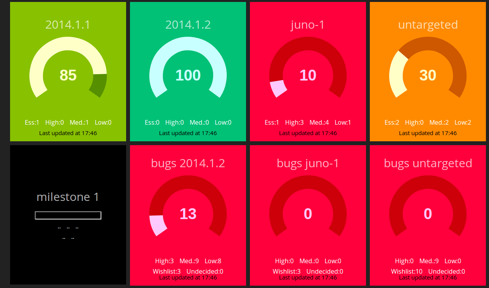

Launchpad Project Release Management Dashboard (LPPRMD)
=======================================================

Launchpad project release management automated dashboarding, based on dashing.io &amp; launchpadlib tool

Pre-requisites
--------------

With the application comes a Dockerfile so that you can easily clone this repository, build and run the docker image to get the application up and running in a Docker container.

That said, if your only need is to display a project dashboard, the only pre-requisite would be a proper "docker" install. cf: https://www.docker.io/gettingstarted/#h_installation

Now, if you want to contribute or customize the dashboard, of course you would still need a proper "docker" installation, but to ease the development process, it's recommended to run the application locally and not in a container. The Dockerfile will provide you everything that is required to run the application from scratch. You can refer to it as a sufficient installation guide, assuming you're running an ubuntu distro.

How does it work ?
------------------

The application is based on Dashing ( cf: http://dashing.io ) and on the launchpad's API.
Dashing provides a simple job scheduler which runs ruby scripts, but as the launchpad's API is not a pure REST/json API, it is more approriate to use the python based client "launchpadlib" ( cf : https://help.launchpad.net/API/launchpadlib ) to extract data from launchpad.

The dashing dashboard starts an listens on the 3030 default port. A series of python scripts can be run at any time, and they will update the different widgets data on the dashboard by simple HTTP POST calls.

Within the docker container, these scripts are installed in a crontab.

Building the Docker image
-------------------------

*cd* into the root directory and execute:

	docker build --tag lpprmd .

Running the Docker container
----------------------------

Lets say your launchpad project name is "abracadabra"

From anywhere, execute: 

	CONTAINER_ID=$(docker run -d -e "PROJECTS_IDS=project1,project2" lpprmd)

Then retrieve its ip:

	docker inspect --format='{{.NetworkSettings.IPAddress}}' $CONTAINER_ID

And access this urls from your web browser:

	http://[CONTAINER_IP]:3030/default
	http://[CONTAINER_IP]:3030/project1
	http://[CONTAINER_IP]:3030/project2

Troubleshooting
---------------

If the docker container doesn't start, you can access its logs when you execute:

	docker logs $CONTAINER_ID
or

	docker top $CONTAINER_ID aux

Another way is to log in the container via ssh. The docker build phase includes a special file name "authorized_keys" in which you can put your ssh pub key. Then try to see what is happening from the very inside of the container.
        
	CONTAINER_IP=$(docker inspect --format='{{.NetworkSettings.IPAddress}}' $CONTAINER_ID)
	ssh root@$CONTAINER_IP